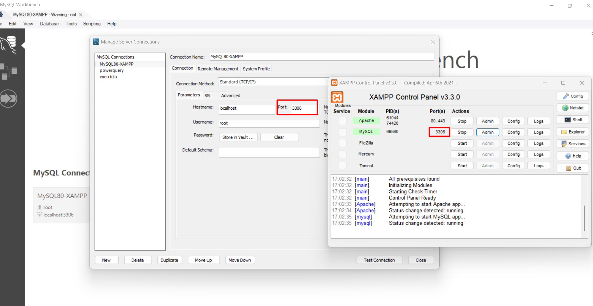
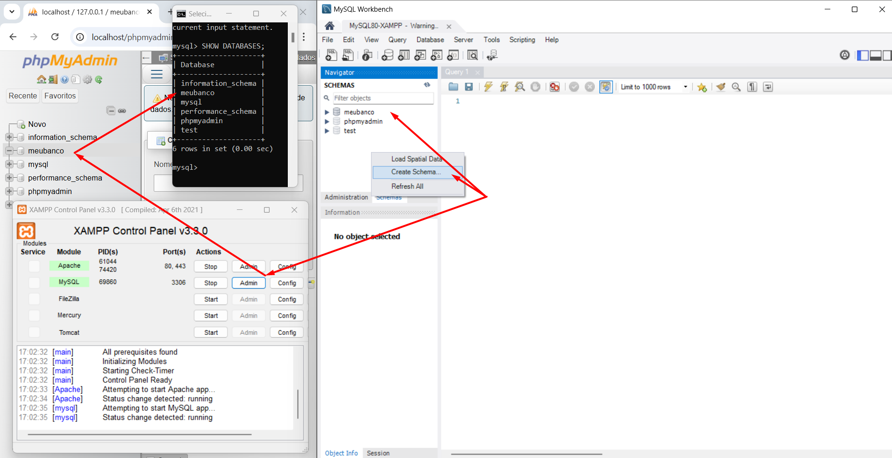
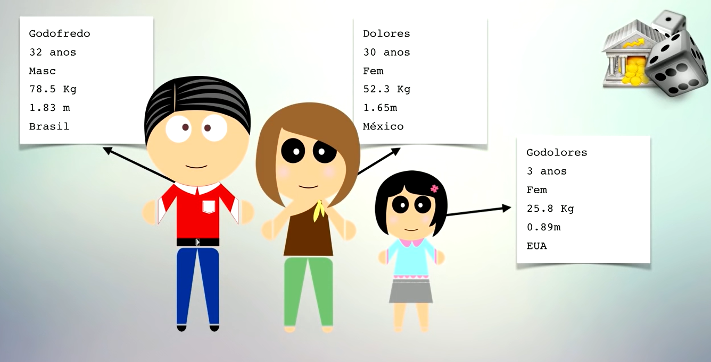
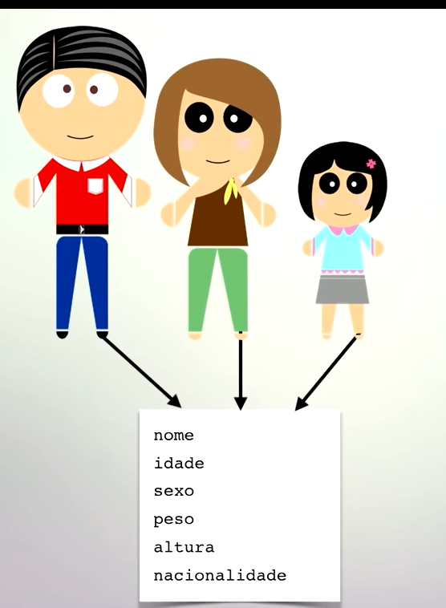
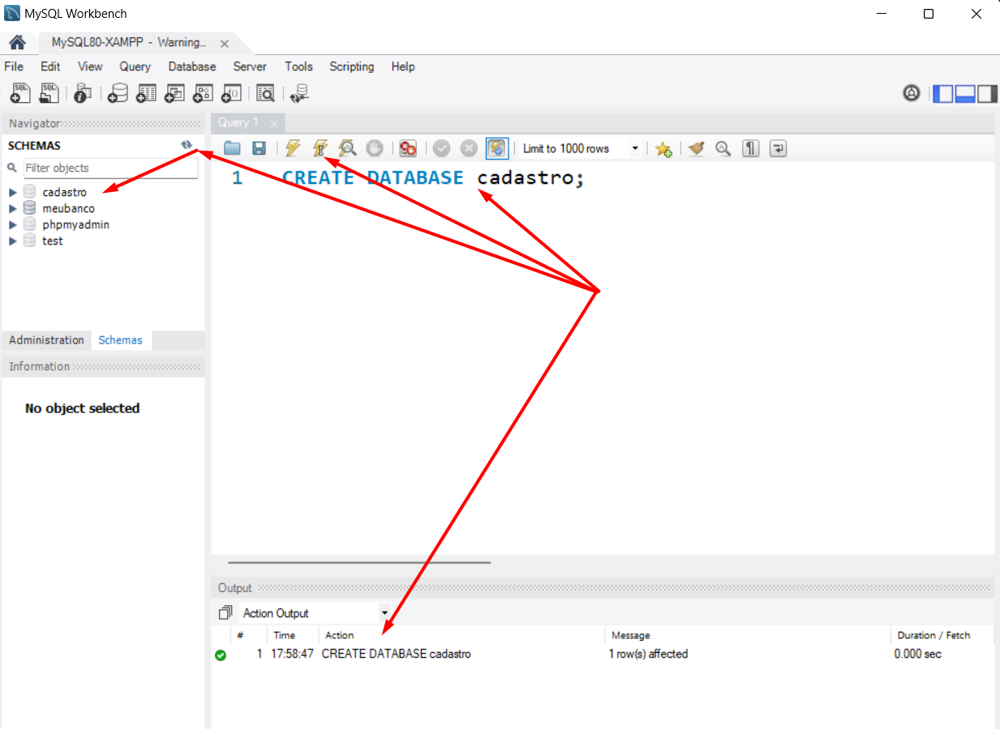
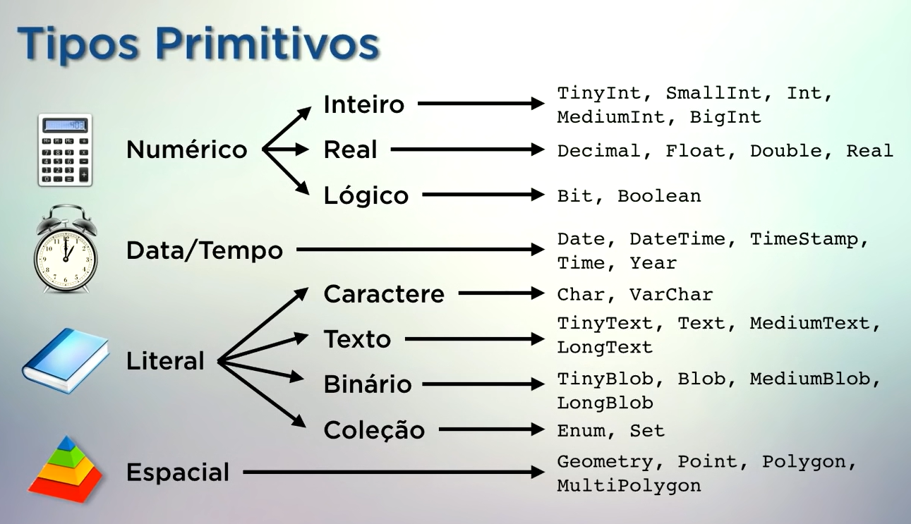
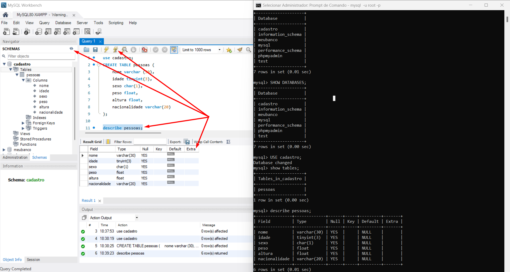
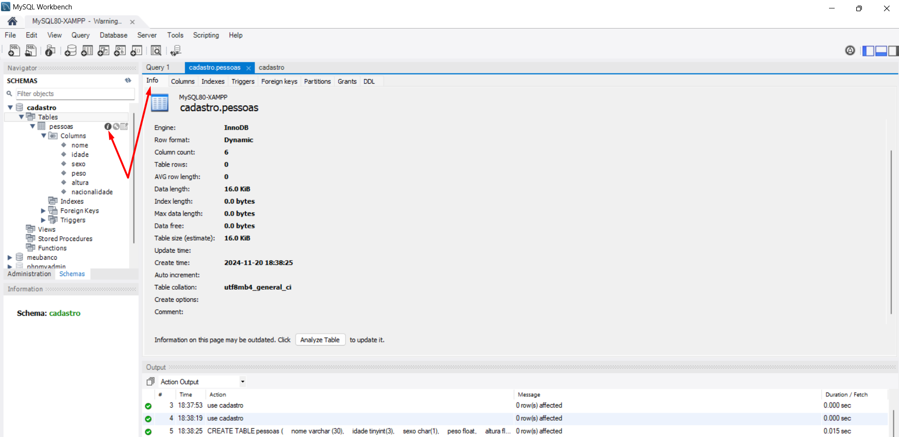

<h1 align="center">Banco de Dados MySQL</h1>

<h3 align="center"> Canal do YouTube: <a href="https://www.youtube.com/watch?v=Ofktsne-utM&list=PLHz_AreHm4dkBs-795Dsgvau_ekxg8g1r&index=1">Gustavo Guanabara
</a> </h3>

> Não usei WAMP

**(...) continua ->Curso MySQL #04 - Melhorando a Estrutura do Banco de Dados**

> </br> > </br>

> </br>

- Essas 3 pessoas tem características semelhantes;

> </br>

- Cada um tem seu própio peso, altura (valores são diferentes).. e isso os faz instâncias, os faz pessoas diferentes umas das outras;

- E esse é o **OBJETIVO** do banco de dados registrar instâncias separadas de coisas que tem características semelhantes;

> </br>

- Características diferentes, coloca em conteiners diferentes;
- Bancos de dados -> são coleções de dados, que são de caracteristicas separadas mas que estão organizadas em locais específicos;
- Os locais específicos são as tabelas;
- As tabelas guardam dados de coisas que tem características semelhantes;
- Os dados que estão dentro das tabelas também tem um nome específico, que são registros;

- **RESUMINDO** -> bancos de dados são conjuntos de tabelas e tabelas são conjuntos de registros e registros são compostos por campos;

> </br>

> </br>

- Essas características são chamadas de **'campos'**;

> </br>

- MySQL - PRECISÃO -> como os dados vão ser armazenados em disco, precisa saber dimensionar muito bem a estrutura da sua tabela;
- A diferença desses tipos é q a quantidade de bytes que ele vai utilizar para armazenar este dado:</br>

- TinyInt -> usa muito menos dados do que o BigInt;
- BigInt -> usa muitos bytes em disco e o TinyInt vai usa pouquinho;
- Isso vai influenciar diretamente no tamanho do número que você vai guardar, Exemplo: idade não precisa utilizar o int, usa o TinyInt que utiliza apenas 3 bytes na memória;
- Char -> fixo - Exemplo: se um nome tem 30 letras, vai armazenar com 30 letras; nome 'Zé', só usou 2 letras, vai ter 2 letras gurdadas e o resto tudo preenchido com espaço, porque no disco disse que vai ter 30 espaços fixos;
- VarChar -> variante - o nome vai ter 30 letras, 'Zé', vai guardar só 2 e vai deixar os outros la disponíveis, não vai colocar espaço, não vai ocupar 30;
- Textos é para textos longos quer a descrição de uma pessoa, quer guardar um texto longo no seu banco de dados, usa o tipo 'Text', quer guardar um nome, um endereçe, um telefone, uma coisa caractere, guarda no tipo Char ou VarChar;
- Tipo 'Blob' - permite guardar qualquer coisa em binário por exemplo, uma imagem, apesar de não ser recomendado guardar uma imagem dentro de um banco de dados é possível utilizando esse tipo;
- Enum e Set são tipos que pode configurar quais são os valores permitidos e na hora do cadastro ele so vai aceitar esses valores;
- Tipo 'Espacial' - permite guardar informações sobre volumétricos;

> </br>

- Para executar um comando precisa selecionar e clica no raio;

```
mysql -u root -p

SHOW DATABASES;

CREATE DATABASE cadastro;

CREATE TABLE pessoas (
    nome varchar (30),
    idade tinyint(3),
    sexo char(1),
    peso float,
    altura float,
    nacionalidade varchar(20)
);

describe pessoas;

status; (ve qual banco esta aberto)

show tables;
```

> </br>

**(...) continua ->Curso MySQL #04 - Melhorando a Estrutura do Banco de Dados**

## �� Tecnologias

<div>


       
</div>
