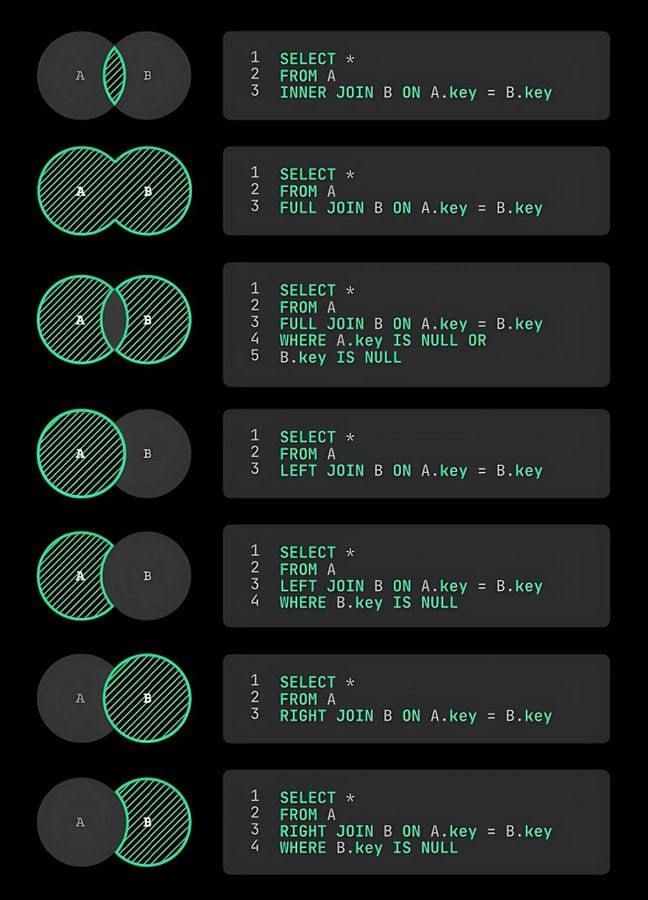

<h1 align="center">Banco de Dados MySQL</h1>

<h3 align="center"> Canal do YouTube: <a href="https://www.youtube.com/watch?v=Ofktsne-utM&list=PLHz_AreHm4dkBs-795Dsgvau_ekxg8g1r&index=1">Gustavo Guanabara
</a> </h3>

> Não usei WAMP

- **``INNER JOIN:``** Retorna linhas quando houver uma correspondência em ambas as tabelas A e B;
````
SELECT *
FROM A
INNER JOIN B ON A.key = B.key
````
- **``FULL JOIN:``** Retorna todas as linhas de A e B, com NULLs onde não houver correspondência;
````
SELECT *
FROM A
FULL JOIN B ON A.key = B.key
````
- **``SELECT WHERE A.key IS NULL OR B.key IS NULL:``** Retorna todas as linhas que não possuem uma correspondência em uma das tabelas;
````
SELECT *
FROM A
FULL JOIN B ON A.key = B.key
WHERE A.key IS NULL OR B.key IS NULL
````
- **``LEFT JOIN:``** Retorna todas as linhas de A e as correspondências em B;
````
SELECT *
FROM A
LEFT JOIN B ON A.key = B.key
````
- **``LEFT JOIN WHERE B.key IS NULL:``** Retorna todas as linhas de A que não possuem correspondência em B;
````
SELECT *
FROM A
LEFT JOIN B ON A.key = B.key
WHERE B.key IS NULL
````
- **``RIGHT JOIN:``** Retorna todas as linhas de B e as correspondências em A;
````
SELECT *
FROM A
RIGHT JOIN B ON A.key = B.key
````
- **``RIGHT JOIN WHERE B.key IS NULL:``** Retorna todas as linhas de B que não possuem correspondência em A;
````
SELECT *
FROM A
RIGHT JOIN B ON A.key = B.key
WHERE B.key IS NULL
````

> </br>


> </br> > </br>

> </br>

- Essas 3 pessoas tem características semelhantes;

> </br>

- Cada um tem seu própio peso, altura (valores são diferentes).. e isso os faz instâncias, os faz pessoas diferentes umas das outras;

- E esse é o **OBJETIVO** do banco de dados registrar instâncias separadas de coisas que tem características semelhantes;

> </br>

- Características diferentes, coloca em conteiners diferentes;
- Bancos de dados -> são coleções de dados, que são de caracteristicas separadas mas que estão organizadas em locais específicos;
- Os locais específicos são as tabelas;
- As tabelas guardam dados de coisas que tem características semelhantes;
- Os dados que estão dentro das tabelas também tem um nome específico, que são registros;

- **`RESUMINDO -> bancos de dados são conjuntos de tabelas e tabelas são conjuntos de registros e registros são compostos por campos, os campos no MySQL são chamados de colunas ou atributos;`**

> </br>

> </br>

- Essas características são chamadas de **'campos'**;

> </br>

- MySQL - PRECISÃO -> como os dados vão ser armazenados em disco, precisa saber dimensionar muito bem a estrutura da sua tabela;
- A diferença desses tipos é q a quantidade de bytes que ele vai utilizar para armazenar este dado:</br>

- TinyInt -> usa muito menos dados do que o BigInt;
- BigInt -> usa muitos bytes em disco e o TinyInt vai usa pouquinho;
- Isso vai influenciar diretamente no tamanho do número que você vai guardar, Exemplo: idade não precisa utilizar o int, usa o TinyInt que utiliza apenas 3 bytes na memória;
- Char -> fixo - Exemplo: se um nome tem 30 letras, vai armazenar com 30 letras; nome 'Zé', só usou 2 letras, vai ter 2 letras gurdadas e o resto tudo preenchido com espaço, porque no disco disse que vai ter 30 espaços fixos;
- VarChar -> variante - o nome vai ter 30 letras, 'Zé', vai guardar só 2 e vai deixar os outros la disponíveis, não vai colocar espaço, não vai ocupar 30;
- Textos é para textos longos quer a descrição de uma pessoa, quer guardar um texto longo no seu banco de dados, usa o tipo 'Text', quer guardar um nome, um endereçe, um telefone, uma coisa caractere, guarda no tipo Char ou VarChar;
- Tipo 'Blob' - permite guardar qualquer coisa em binário por exemplo, uma imagem, apesar de não ser recomendado guardar uma imagem dentro de um banco de dados é possível utilizando esse tipo;
- Enum e Set são tipos que pode configurar quais são os valores permitidos e na hora do cadastro ele so vai aceitar esses valores;
- Tipo 'Espacial' - permite guardar informações sobre volumétricos;
- **1 Int ocupa 11 bytes e um tinyint ocupa 3 bytes;**

> </br>

- Para executar um comando precisa selecionar e clica no raio ou clica em cima do comando ctrl + enter;

> </br>

> Vou criar um banco com 2 parâmetros, esses parâmetros em MySQL se chamam 'CONSTRAINTS', ele já irá ter uma codificação de caracteres pos padrão e um collation por padrão, todos eles voltados para o UTF8 (aceita caracteres acentuados no padrão);

```
CREATE DATABASE cadastro
    default character set utf8
    default collate utf8_general_ci;
```

> Otimizada - melhorada nos campos:

```
CREATE TABLE pessoas (
    nome varchar (30),
    idade tinyint(3),
    sexo char(1),
    peso float,
    altura float,
    nacionalidade varchar(20)
);
```

- Primeira coisa trabalhar com números reais; isso porque utilizei o tipo float, um tipo muito genérico, que já coloca lá o valor no formato que ele decidir no banco de dados;
- Vamos partir para o tipo decimal, que é um tipo mais personalizável;
- Vamos cadastrar o dia que a pessoa nasceu em vez de cadastrar a idade dela;
- Colocar a configuração de caracteres padrão na criação da tabela, para isso vamos colocar lá no final, no fechamento do parêntese;
- Adicionar mais algumas 'constraints', lembrando que 'constraints' são regras que a gente vai definir para a criação de coisas dentro do meu banco de dados;

  > CONSTRAINTS ->
- 'Not Null' -> significa que você vai ter que preencher os dados, por padrão se eu quiser cadastrar uma pessoa e não quiser informar por exemplo a data de nascimento dela, sem problema, por padrão; mas se você quiser obrigar, por exemplo que toda pessoa tenha nome, não tem como cadastrar uma pessoa, se ela não tiver nome, então nesses campos que são obrigatoriamente digitáveis, coloca a 'constraints' 'not null';
- O sexo em vez de 'char', vou utilizar um tipo de coleção que é o 'enum', quando usa o 'set' ou 'enum', colocando entre parenteses, entre aspas os valores, separados por vírgula, estou dizendo quais são os valores que serão aceitos, então para sexo, ele só vai aceitar 'M' ou 'F', isso vai permitir que você defina a estrutura de forma um pouco mais rígida, para que o cara não coloque a letra 'A' por exemplo;
- O peso que era float agora vou colocar com decima e vou colocar 5,2 entre parentese separados por vírgula; '5,2' -> imagina que sejam 5 casas ao todo; o segundo numero é a quantidade de numeros que vão ficar após a vírgula, então desses '5' '2' vão ficar após a vírgula, '3' antes da vírgula; com isso economiza espaço e configura qual a precisão exata que o número vai precisar ter; 2 é a quantidade de casa decimal;
  > </br>
- Nacionalidade 'default 'Brasil'' -> se ninguém digitar nada, por padrão será Brasil;
- 'id' -> Numa tabela é importante que defina pelo menos um dos campos, como um campo que chamamos de chave primaria, um campo 'chave primária' ele não se repete, então por exemplo você tem uma academia, você tem sua matrícula na academia, seu cadastro de pessoa física (CPF); para definir o 'id' como chave primaria, vai na última linha e coloca 'PRIMARY KEY';
- 'auto_increment' -> a primeira pessoa que cadastrar vai ser código 1, a segunda 2...tudo isso automaticamente;

```
CREATE TABLE pessoas (
    id int not null auto_increment,
    nome varchar (30) not null,
    nascimento date,
    sexo enum ('M', 'F'),
    peso decimal (5,2),
    altura decimal (5,2),
    nacionalidade varchar(20) default 'Brasil',
    PRIMARY KEY (id)
) default charset  = utf8;
```

- **OBS.:** pode acontecer em algum tutorial, ou material, inclusive na exportação do seu banco de dados, que os nomes dos campos estejam colocados entre `crase`, isso permite que utilize por exemplo, campos com ascentos, campos com espaços, apesar disso não ser o recomendado, então você pode ver isso aqui em alguns tutoriais ou algum material específico;
- Todo caractere em SQL entre 'aspas' simples, e toda palavra de definição entre `crases`;

```
CREATE TABLE `pessoas` (
    `nome` varchar (30) not null,
    `nascimento` date,
    `sexo` enum ('M', 'F'),
    `peso` decimal (5,2),
    `altura` decimal (5,2),
    `nacionalidade` varchar(20) default 'Brasil'
) default charset  = utf8;
```

```
COMO FICO

CREATE DATABASE cadastro
    default character set utf8
    default collate utf8_general_ci;

use cadastro;

CREATE TABLE `pessoas` (
	`id` int not null auto_increment,
    `nome` varchar (30) not null,
    `nascimento` date,
	`sexo` enum ('M', 'F'),
    `peso` decimal (5,2),
    `altura` decimal (5,2),
	`nacionalidade` varchar(20) default 'Brasil',
    PRIMARY KEY (id)
) default charset  = utf8;
```

> INSERINDO DADOS NA TABELA

- Todo comando SQL que faz parte da estrutura, que faz parte da definição de estrutura de um banco de dados, segue um sigla 'DDL' - significa 'Data Definition Language' 'Liguagem de definição de dados'Ex.: 'CREATE DATABASE';
- Comando DDL - 'CREATE TABLE' -> ele é um comando para definição da minha tabela, isso é vou mexer nas definições da minha tabela;
- As datas nos bancos de dados MySQL, são dadas na seguinte maneira: ano-mês-dia;
- O que esta estre 'aspas' são dados, o que não esta entre aspas é considerado 'constrain';
- Insira na tabela pessoas com os campos (id,nome,...) os valores (1, Godofredo,...);

```
INSERT INTO pessoas
(id, nome, nascimento, sexo, peso, altura, nacionalidade)
values
('1', 'Godofredo', '1994-01-02', 'M', '78.5', '1.83', 'Brasil');
```

- Não precisa especificar o 'id' porque esta com 'auto_increment';

```
INSERT INTO pessoas
(nome, nascimento, sexo, peso, altura, nacionalidade)
values
('Godofredo', '1994-01-02', 'M', '78.5', '1.83', 'Brasil');
```

- Selecione tudo de pessoas, selecione todos dados de pessoas;
- Tem como fazer colocando o 'id'; onde iria colocar o valor do id coloca uma 'constraint', lembrando que constrain não tem aspas - 'default' - padrão;

```
INSERT INTO pessoas
(id, nome, nascimento, sexo, peso, altura, nacionalidade)
values
(DEFAULT, 'Augusto', '1994-01-02', 'M', '62', '1.70', 'Brasil');
```

- Se for inserir dados e ordem dos campos for exatamente a ordem que foi definida no banco. então não precisa dizer quais são os campos;
  > </br>

> INSERIR VÁRIOS DADOS AO MESMO TEMPO

```
INSERT INTO pessoas values
(DEFAULT, 'Teste', '1999-01-02', 'M', '78', '1.70', default),
(DEFAULT, 'Teste1', '1994-01-02', 'M', '62', '1.90', default),
(DEFAULT, 'Teste2', '1994-01-02', 'M', '62', '1.90', 'Espanha');
```

- INSERT INTO - serviu para inserir dados, manipular dados; é da classificação 'DML' - 'Data Manipulation Language';

> MODIFICAÇÃO DA ESTRUTURA DA TABELA

- ALTER TABLE - comando para alterar a estrutura da tabela;
- A primeira coisa é adicionar uma nova coluna;
- Quando adiciona uma coluna, ela sempre vai parar no final;

```
alter table pessoas
add column profissao varchar(50);
```

- 'Drop' - Remover uma coluna;

```
alter table pessoas
drop column profissao;
```

- 'AFTER' - Para colocar a coluna criada em outra posição;

```
alter table pessoas
add column profissao varchar(10) after nome;
```

- 'FIRST' - Para colocar a coluna criada em primeiro;

```
alter table pessoas
add column codigo int first;
```

> MODIFICANDO DEFINIÇÕES:

- 'MODIFY' - consegui alterar tipo primitivo do campo e todas as contrains, pode redefinir as contrains, não pode renomear o campo;

```
alter table pessoas
modify column profissao varchar(20) not null;
```

- Essa coluna profissao esta vazia então não pode ter 'not null'; precisa colocar o 'default '''; nunca pode fazer com que uma 'constraint' passe por cima da outra, se não vai receber um aviso;

```
alter table pessoas
modify column profissao varchar(20) not null default '';
```

> Modificar o nome de uma coluna e também suas constraints e seu tipo primitivo;

- 'CHANGE' - tem uma sintaxe um pouco diferente, 'change' tem que colocar o nome velho e o nome novo;

```
alter table pessoas
change column profissao prof varchar(20);
```

- No lugar de renomear uma coluna, renomear uma tabela inteira;

```
alter table pessoas
rename to gente;
```

> Mais uma tabela;

- 'IF NOT EXISTS' ou 'IF EXISTS' - é um parâmetro do 'CREATE' que é o seguinte só vai criar uma tabela ou um banco de dados se ele não existir, só vai apagar uma tabela ou um banco se existir;
- 'UNIQUE' - não confunda UNIQUE com PRIMARY KEY; primary key além de ser unique, ela tem outras características, unique é o seguinte, não to dizendo que o nome é uma chave primária, ele não vai identificar os registros mas ele não vai deixar colocar dois cursos com o mesmo nome;
- 'INT' - a `carga` ela é int, é carga horária, é quantas horas temo curso por exemplo um curso de 10h, é um número inteiro mas percebe que esse número nunca é negativo, coloca a 'constrain' específica que é 'UNSIGNED' - significa sem sinal, isso vai economizar um byte para cada registro que tenha `carga` registrada;

```
create table if not exists cursos (
    nome varchar (30) not null UNIQUE,
    descricao text,
    carga int UNSIGNED,
    totaulas int,
    ano year DEFAULT '2016'
) default charset = utf8;
```

- Adicionar a chave primária, coloca o código do curso como primeira coluna; para fazer isso utiliza o 'ALTER TABLE' `cursos`, que é o nome da nossa tabela; coloca o identificador do curso como primeira coluna na minha tabela de cursos;

```
alter table cursos
add column idcurso int first;
```

- Adicionar chave primaria não tem como adicionar a coluna e colocar ela como chave primaria em 1 comando, tem que utilizar 2;

```
alter table cursos
add primary key (idcurso);
```

> APAGANDO A TABELA;

- A palavra 'drop' pode ser um parâmetro de 'alter table' - 'ALTER TABLE DROP' é para apagar coluna;

```
drop table cursos;
```

> </br>

> MANIPULANDO REGISTROS = LINHAS = TUPLAS

> </br>

> </br>

- Não consegui manipular várias linhas ao mesmo tempo, um comando manipula uma linha mas consegui mexer dentro de uma linha, em várias colunas ao mesmo tempo;
- 'UPDATE' - é atualize; 'SET' - é configure; 'WHERE' é onde; Modificar a tabela 'cursos' modificando o conteudo da coluna nome para 'HTML5' onde o 'idcurso' é igual a '1';

```
update cursos
 set nome = 'HTML5'
 WHERE idcurso = '1';
```

- 'LIMIT' - é para limitar quantas linhas vão poder ser afetadas, vai limitar a ação do meu comando; é uma segurança;

> </br>

- O 'UPDATE' mexi em linhas existentes mas mantem elas lá;
- 'DELETE FROM cursos' - apague da tabela cursos;

> </br>

- 'TRUNCATE' - vai fazer uma truncagem, trucar uma tabela é apagar todos os registros;

```
truncate cursos;
```

- Diferença de 'DROP TABLE' e 'TRUNCATE', drop table apaga a tabela inteira, apaga os dados e apaga tambem a estrutura da tabela; o truncate apaga os dados mas mantem a estrutura la por isso não é 'DDL';

> </br>

> GERENCIANDO CÓPIAS DE SEGURANÇA

-'DUMP' - backup de um banco de dado; porque a base de dados não esta numa máquina, ela está num servidor; basicamente um dump é qual foi o passo a passo que quem crio o banco de dados fez para poder chegar ao banco de dados nesse estado que ele esta; basicamente vai criar uma lista de comandos;

> </br>

- Se não marcar essa opção não vai vir a criação do banco de dados e aí vai forçar você digite o primeiro e crie um banco de dados no servidor e só então possa importar um dump
  > </br>

> USANDO O PHPMyAdmin ->

- PHPMyAdmin -> é uma aplicação Web com o objetivo de facilitar e automatizar a criação de bancos de dados MySQL;
  **PULEI O Curso MySQL #10 - PHPMyAdmin (Parte 2), NÃO É MEU FOCO NO MOMENTO**

> OBTENDO DADOS DAS TABELAS

> ORDENAÇÃO

> </br> > </br>

- Para filtrar as colunas, tira o '\*' e coloca quais são as colunas que quer para aparecer, inclusive na ordem que quiser.
  > </br>

> </br>

- Quero saber quais cursos foram lançados em 2016;

```
select * from cursos
where ano = '2016'
order by nome;
```

- Mostrar somente o ano e a carga;

```
select nome, carga from cursos
where ano = '2016'
order by nome;
```

- 'ResultSet' - é o resultado de uma consulta;
  > </br>
- 'QUERY' - é uma pegunta, uma solicitação;
  > </br>
- Operador 'BETWEEN' - entre uma coisa e outra;

```
SELECT nome, ano from cursos
where ano between 2014 and 2016;
```

- Diferença entre 'IN' e 'BETWEEN' - no in vou poder colocar valores específicos, no between posso especificar faixas de valores;

```
select nome, descricao, ano from cursos
where ano in (2014, 2016)
order by ano;
```

> </br>

> </br>

- `DQL` - 'Data Query Language' - uma linguagem para perguntas, uma linguagem para questionamentos,

> </br>

- `like` - é um operador;

> </br>

> </br>

> </br>

> </br>

- `_` - exige que tenha algum caractere aqui;
- `ph%p%` - peguei todos os cursos que tem um nome começados com 'ph', '%' tenho nada ou alguma coisa termine com 'p' e que tenha alguma coisa no final '\_';

```
select * from cursos
where nome like 'ph%p%_';
```

- `DISTINCT` - ele pega quais foram minhas ocorrências, quais são diferentes; vai considerar apenas uma ocorrência de cada valor dentro de registro;
- Vai mostrar uma vez o '40':
  > </br>

> FUNÇÃO DE AGREGAÇÃO

- `COUNT` - conta quantos registros aconteceu;

> </br>

> </br>

> </br>

- A função de agregação ela vai ter um número e vai te perguntar, qual curso teve esse número e vai colocar o curso que teve esse número;

> </br>

- `AVG` - vem de Average que é média;
  > </br>

> </br>

> </br>

> `AGRUPAMENTO`

> </br>

- `GROUP BY` -> 'agrupado por';

> </br>

> </br>

- `HAVING` - o having para o gupo 'BY' é mais ou menos semelhante ao 'where' para o 'select'; dentro do 'having' só pode trabalhar com o campo que você agrupo;
  > </br>
- Estou selecionando os anos da tabela de cursos, onde o total de aulas seja acima de 30, só quero selecionar esses, vou agrupar essa seleção por ano e dentro desse agrupamento eu só vou mostrar quem tem ano acima de 2013, ordenado pelo total aqui;
- Selecionar, filtrar, agrupar e dizer dentro desse agrupamento qual você quer exibir, aí você usa o select, where, group by e having;

```
select ano, count(*) from cursos
where totaulas > 30
group by ano
having ano > 2013
order by count(*) desc;
```

> JUNTAR UM SELECT NO OUTRO

- Estou selecionando a carga e o total de horas dos cursos onde o ano seja acima de 2015, vou agrupa-los por carga mas não quero mostrar quem tem carga baixa, quero mostrar somente quem está acima da carga média (a média da carga é 36.6);

```
select carga, count(*) from cursos
where ano > 2015
group by carga
having carga > (select avg(carga) from cursos);
                SAIDA: carga count(*)
                        40      6
                        50      1
                        60      5
```

> RELACIONANDO AS TABELAS

- `ENTIDADE` - uma entidade para um banco de dados é como se fosse um contêiner onde vou colocar dados sobre alguma coisa ou sobre alguma pessoa nesse meu caso aqui o meu contêiner gafanhoto vai conter dados de alunos dados de gafanhotos;

> </br>

- `ATRIBUTOS` - toda entidade possui uma coleção de atributos definidos, esses atributos vão compor os dados que compõem cada um dos elementos que estão dentro dessa entidade;

**`DADOS SÃO REPRESENTADOS EM FORMA DE ATRIBUTOS ESSES CONJUNTOS DE ATRIBUTOS VÃO IDENTIFICAR TUPLAS VÃO IDENTIFICAR REGISTROS VÃO IDENTIFICAR COISAS QUE ESTÃO ARMAZENADAS DENTRO DE ENTIDADES`**

- A primeira base do `modelo relacional` foi uso de chaves e essas chaves primárias, elas servem para identificar as tuplas e elas vão servir também para relacionar as entidades;

- Existe uma relação entre um e outro e é claro existe uma entidade dominante e uma entidade relacionada a ela mas nada impede que eu faça leitura nos dois sentidos;

- `Diagrama E-R:` -> ele vai mostrar como o modelo relacional está sendo aplicado dentro desse minimundo, dentro dessa minha possibiliade, dentro dessa minha situação que eu quero criar um banco de dados;

  > </br>

- `n` = `CARDINALIDADE` - ela pode ser simples ou múltipla, um ou n; 'muitos para muitos'; 'n para n';

  > </br>

- Uma tupla não tem obrigatoriedade de ter uma outra tupla; classificação 'um-para-um':

  > </br>

- Relacionamento 'um-para-muitos';

  > </br>

- O primeiro passo deve ser modelar as entidades com seus atributos e seus relacionamentos e depois classificar cada um dos relacionamentos, colocando cardinalidade nas suas entidades;

- `CHAVE PRIMÁRIA` - é um atributo específico que identifica as 'tuplas';
- `CHAVE ESTRANGEIRA` - entidade x com sua chave primária do outro lado entidade y com sua chave primária, se quiser fazer uma relação entre uma entidade e outra, relações são troca de chaves; 'chave estrangeira' era a 'chave primária' de alguém, veio de um lugar para outro;

  > </br>

- Basicamente criar relacionamentos entre tabelas é fazer troca de chaves, é pegar chave primária de um lado e colocar para outro lado;

- Geralmente representa na esquerda as entidades dominantes; representei marido como dominante, peguei a chave primária da esposa e tranferi; 'E''cpf-esposa' - o nome não precisa ser o mesmo mas os dados precisam ser os mesmo, os atributos tem que ser compatíveis;

- Regras para relacionamentos um-para-um -> decide qual entidade dominante, pega a chave primária da que não é dominante e jogo como chave estrangeira pra minha entidade dominante;

  > </br>

- A regra do relacionamento 'um-para-muitos' ou 'muitos-para-um' -> pega a chave primária do lado um e coloca no lado muitos como chave estrangeira;

  > </br>

- Relacionamentos 'muitos-para-muitos' -> a regra é desmembrar esse relacionamento muitos-para-muitos em vários relacionamentos de um-para-muitos;

- O relacionamento 'compra' viro uma 'entidade', compra tambem tem atributos; tem três entidades agora falta os relacionamentos, cria dois mini relacionamentos e coloca a cardinalidade; o que tinha de relacionamento muitos-para-muitos se transformou em nesse conjunto relacional;

> </br> > </br>

> RELACIONANDO AS TABELAS

> </br>

- `ENGINE` - máquina de criação de tabelas;
- `InnoDB` - é um mecanismo, que vai permitir a criação de tabelas com algumas características a principal características desse 'engine' é suportar chaves estrangeiras e também permite a compatibilidade com os quatro conceitos fundamentais de uma boa transação;

- `TRANSAÇÃO` - tudo aquilo que você pode pedir para um banco de dados e ele executar e te dar uma resposta; toda ação; e uma transação para ela acontecer precisa seguir as quatro principais regras: `ACID`;

**`É UM PRINCÍPIO FUNDAMENTAL DA TEORIA DE BANCO DE DADOS:`**

- `ATOMICIDADE` -> uma transação tem que ser atômica, ela não deve ser dividida em sub tarefas; ou toda tarefa é feita ou nada vai ser considerado;
- `CONSISTÊNCIA` -> um banco de dados que estava consistente anteriormente, tem que continuar consistente após uma transação; não pode ter falhas se isso acontecer volta para o estado anterior;
- `ISOLAMNETO` -> quando tem duas transações acontecendo em paralelo, elas devem acontecer como se tivessem sendo executadas de forma isoladas;
- `DURABILIDADE` -> ela tem que ser durável o tempo que for necessário; por exemplo se você salvou dado de um cliente, você quer que esse dado do cliente fique lá o tempo necessário que precise dele;

- Sempre que olhar um rêtangulo expande ele e imagine instâncias dentro dele;

**`NÃO CONSEGUI IMPORTAR O BANCO PELO 'SERVER' 'DATA IMPORT' QUE FOI MOSTRADO NA AULA, FIZ DESSA MANEIRA:`**

- 'CREATE SCHEMA - 'cadastro'' -> 'Open SQL Script' -> executa o dump com 'Ctrl+Shift+Enter';

- Primeiro adiciona um campo 'cursopreferido', agora precisa dizer que esse curso preferido é uma chave estrangeira para poder fazer aquela ligação; para fazer isso precisa de outro alter table `ADD FOREIGN KEY (cursopreferido)` -> adicionando cursopreferido como uma chave estrangeira, aí precisa indicar qual a referência `references cursos(idcurso)` -> significa que o cursopreferido da tabela de gafanhotos está ligado com idcurso da tabela de cursos;

```
alter table gafanhotos add cursopreferido int;

alter table gafanhotos
add foreign key (cursopreferido)
references cursos(idcurso);
```

- Precisa fazer uma ligação entre o cursopreferido que é chave estrangeira e o idcurso da tabela curso que é a chave primaria para a gente poder fazer aquela ligação entre chave primaria e chave estrangeira que é extremamente necessária para garantir a integridade referencial;

> </br>

- `MUL` -> o cursopreferido esta com 'int' que é o mesmo tipo e no 'key' tenho `MUL` - é a representação de uma chave mútipla, no nosso caso aqui uma chave estrangeira;

- Agora precisa começar a cadastrar os cursos preferidos de cada aluno;
- O meu aluno 1 que é o Daniel vai gostar do curso 6 que é o MySQL:

```
update gafanhotos set cursopreferido = '6' where id = '1';
```

- Fazendo sem comando:

  > </br>

- Quando cria chave estrangeira não vemos muita utilidade, na prática vamos tentar apagar o curso de MySQL;

```
DELETE FROM CURSOS where id = '6';
              SAÍDA: 'erro Constraint FOREIGN KEY', esse erro foi de integridade referencial;
```

- O curso de 'PHP' é o único que é possível apagar porque ele não tem relação com nenhum;

> </br>

> INTEGRIDADE REFERENCIAL -> eu não consigo modificar um campo se ele for afetar a minha `transação` se essa transação começar a gerar inconsistência que seria o caso ele não deixaria acontecer;

- Se executa select em gafanhotos eu vejo os dados do gafanhoto e vejo o curso que ele prefere, só que não vejo o nome do curso que ele prefere e sim o código;

```
select nome, cursopreferido from gafanhotos;
        SAÍDA: Daniel Morais	    6
               Talita Nascimento	8
```

- `JUNÇÕES;`

- Ele junto gafanhoto e curso = cada aluno vai ser junto com todos os cursos, o que precisa fazer é filtrar essas coisas, para ter um filtro tem uma 'cláusula' sempre que eu usar `JOIN` que é a clásula `ON`aí coloca quais são as relações; o gafanhoto se liga ao curso através de suas chaves estrangeira e primária;

```
select gafanhotos.nome, gafanhotos.cursopreferido, cursos.nome, cursos.ano
from gafanhotos join cursos;
```

```
select gafanhotos.nome, gafanhotos.cursopreferido, cursos.nome, cursos.ano
from gafanhotos join cursos
on cursos.idcurso = gafanhotos.cursopreferido;
```

> </br>

- `AS` -> apelidos de coluna; se quiser não precisa colocar 'inner';

```
select g.nome, c.nome, c.ano
from gafanhotos as g inner join cursos as c
on c.idcurso = g.cursopreferido
order by g.nome;
```

> </br>

- O que interessa no 'inner join' é apenas as linhas coloridas;

  > </br>

- `OUTER JOIN` -> ele vai tratar exatamente os conceitos do inner junto com aqueles dados que não tem relação com nenhuma outra tabela;

- A esquerda do 'join' esta a tabela gafanhotos e a direita a tabela cursos; se eu quiser mostrar todos gafanhotos inclusive aqueles que não preferem nada, vou utilizar o `outher join` só que tenho duas possibilidades ou vou considerar gafanhotos como preferencial ou cursos, considerando primeiro gafanhotos `LEFT`; SAÍDA: mostrou todos os alunos, idependente de quem prefere ou não:
- Se tirar 'outer' funciona da mesma maneira:

```
select g.nome, c.nome, c.ano
from gafanhotos as g LEFT outer join cursos as c
on c.idcurso = g.cursopreferido
order by g.nome;
```

> </br>

- `RIGHT` - ele esta mostrando todos os cursos independente se ninguém prefere:
  > </br>

> </br>

**`Se coloca somente 'JOIN' estou me referindo ao 'inner join', se quiser referir ao 'outer join' coloca ''right' ou 'left' JOIN', assim que funciona o relacionamento entre tabelas mostrando determinados dados de acordo que eu precise na minha necessidade`**

> Muitas instâncias de um lado e muitas do outro e elas estão se relacionando;

- Diagrama onde 1 gafanhoto prefere 1 determinado curso e cada curso pode ser preferido por vários gafanhoto; você não prefere muitas coisas você prefere uma coisa; é o seu curso preferido, isso nos gera um relacionamento de uma instância de um lado, com muitas instâncias de outro.

> </br>

> </br>

```
create table gafanhoto_assiste_curso (
		id int not null auto_increment,
		data date,
        idgafanhoto int,
        idcurso int,
        PRIMARY KEY (id),
        FOREIGN KEY (idgafanhoto) REFERENCES gafanhotos(id),
		FOREIGN KEY (idcurso) REFERENCES cursos(idcurso)
 ) default charset = utf8;
```

> </br>

> </br>

> ISERINDO REGISTROS

- Esse 'default' identifica que meu id do gafanhoto_assiste_curso vai ser gerado automaticamente, um determinado gafanhoto '1' começou a assistir o curso '2' no dia 01/03/2014:

```
insert into gafanhoto_assiste_curso values
(default, '2014-03-01', '1', '2');
```

> </br>

```
select g.nome, c.nome from gafanhotos g
join gafanhoto_assiste_curso a
on g.id = a.idgafanhoto
join cursos c
on c.idcurso = a.idcurso
order by g. nome;
          SAÍDA:Daniel Morais	    Algoritmos
                Emerson Gabriel 	MySQL
```

- Puxando dado de 3 tabelas, preciso usar 2 'JOIN';

## �� Tecnologias

<div>


       
</div>
